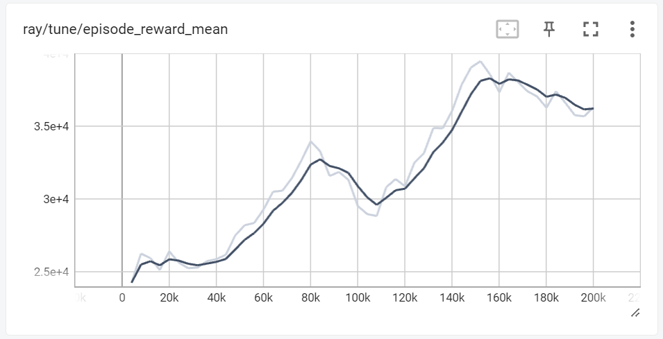

# Stock Trading Reinforcement Learning Module
## Project Summary

This project focuses on applying Reinforcement Learning (RL) to simulate and optimize stock trading strategies. Using the `StockTradingEnv`, a custom Gymnasium environment, we simulate a stock market where an AI agent learns to make trading decisions based on historical stock data. The goal is to maximize financial returns through strategic buying, selling, and holding of stocks. This module is primarily intended for financial analysts, trading enthusiasts, and AI researchers who are keen on exploring the intersection of machine learning and financial markets. The project's outcome is an RL agent trained using Proximal Policy Optimization (PPO) algorithm, demonstrating its capability to adapt and make informed decisions in a simulated stock market environment.

## State Space
The state space in `StockTradingEnv` is a comprehensive representation of the stock market, including:
- Historical stock prices: Open, High, Low, Close, and Volume for each day.
- Agent's financial status: Current balance, number of shares held, average cost per share, total shares sold, and total value of sales.
- The data is normalized to aid in the learning process, scaling each value to a range between 0 and 1.

## Action Space
The action space of the environment is a 2D continuous space:
- Action Type: Represented by a continuous value where 0 indicates 'Buy', 1 indicates 'Sell', and values in between imply a 'Hold' strategy.
- Action Amount: A continuous value representing the percentage of the agent's balance to be used for buying or the proportion of held shares to be sold.

## Rewards
The reward is calculated as the change in net worth, providing an incentive for the agent to increase its financial value. This is based on the balance and the market value of the held stocks. A time factor is also incorporated, scaling the reward over the simulation period.

## RL Algorithm 
This project utilizes the Proximal Policy Optimization (PPO) algorithm, a popular choice in RL for its balance between sample efficiency and ease of tuning. PPO's robustness makes it suitable for the complexities of the stock market environment.

## Starting State
The environment begins with:
- The agent having a predefined initial balance.
- No stock shares held initially.
- The first set of stock data based on the `n_days` parameter, providing the agent with initial market information.

## Episode End
An episode in the environment concludes when:
- The agent reaches the end of the stock data, signifying the completion of a trading period.
- This allows the agent to experience a full cycle of market conditions within an episode.

## Results

## Results

The training progression, as illustrated by the mean episode rewards graph, shows an upward trend in the agent's performance, indicating successful learning. The graph displays the agent's average rewards per episode over the training iterations. After an initial rapid improvement, the reward growth steadies, suggesting the agent is refining its trading strategy.

A smoothing of the reward curve and a decrease in variability toward the end of training imply that the agent's policy is converging on a stable solution. This performance indicates that our RL model, using the PPO algorithm within the `StockTradingEnv`, is capable of developing effective stock trading strategies.

Future efforts could aim to enhance agent performance by experimenting with various state representations and reward structures.

